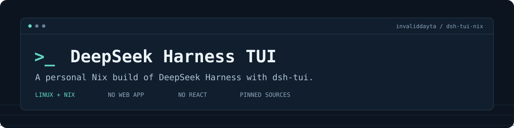

<p align="center">
  
</p>

<p align="center">
  <strong>A simple, terminal-native DeepSeek Harness. With opinions.</strong><br>
  The coding agent, without the web-app baggage.
</p>

<p align="center">
  <code>LINUX</code> &nbsp; <code>NIX</code> &nbsp; <code>PI-TUI</code> &nbsp; <a href="LICENSE">MIT</a>
</p>

<p align="center">
  <a href="#run-it">Quick start</a> &middot; <a href="#make-it-yours">Customize</a> &middot; <a href="docs/guide.md">The guide</a> &middot; <a href="CONTRIBUTING.md">Contribute</a>
</p>

## Less baggage. Still Harness.

[DeepSeek Harness](https://github.com/deepseek-ai/deepseek-harness), the [dsh-tui](https://github.com/dsh-tui/dsh-tui) frontend, and a reproducible Nix build. This is my opinionated distribution: small in scope, with my own tooling and defaults added as I need them.

- **Terminal first.** Pi-TUI, keyboard-driven. No web app, React, or browser RPC gateway.
- **Your choice of model.** DeepSeek, Pi's provider catalog, and custom compatible endpoints. Sign in inside the TUI.
- **Tools for real work.** File editing, image reading, sandboxed commands, subagents, workflows, and persistent sessions.
- **No telemetry exporter.** Session telemetry is disabled by default.

No separate Harness install. No extra background gateway. Provider SDKs still have dependencies—this is focused scope, not a zero-dependency claim.

## Run it

You need **Linux x86-64 or ARM64** and [Nix](https://nixos.org/download/) with `nix-command` and `flakes` enabled.

```sh
nix run github:invaliddayta/dsh-tui-nix
```

Open **`/provider`** to sign in, then **`/model`** to choose a model. Already using DeepSeek? The `DEEPSEEK_API_KEY` environment variable works too.

The first build takes a while. Nix supplies the runtime; you don't need to install Node.js or pnpm yourself.

## At your fingertips

| Command / key | What it does |
| --- | --- |
| `/provider` | Sign in, configure endpoints, or sign out |
| `/model` | Pick a model; your accepted choice becomes the startup default |
| **Ctrl+T** | Cycle the model's available reasoning efforts |
| **Ctrl+R** | Show or hide reasoning text |
| `/resume` | Reopen a saved conversation |
| `/fork` | Branch the latest completed conversation history |
| `/fork --through-turn 3` | Branch through a specific logged turn |

Forking copies **conversation history, not project files**. Both sessions share the workspace. Finish or cancel active work first. [Details](docs/guide.md#fork-a-conversation).

### Let it see a screenshot

Select an image-capable model, such as `/model zai/glm-5.3-flash`, with that provider configured. Then ask:

```text
Use read_image on ./screenshot.png and explain the error shown.
```

PNG, JPEG, WebP, and GIF work through the local image tool. The default `deepseek-v4-pro` is text-only; switch models first. This is file-based image reading, **not clipboard image paste**. [Image support and limits](docs/guide.md#read-images).

## Make it yours

Normal sign-in needs no config editing. For your own setup:

| Change | Where to start |
| --- | --- |
| Providers and local endpoints | `/provider` or [manual settings](docs/guide.md#manual-configuration) |
| Profile overrides | `~/.dsh/profiles/deepseek-harness-tui/cordis.patch.yml` · [guide](docs/guide.md#profile) |
| Reuse OpenCode credentials | [Opt-in bridge](docs/guide.md#opencode-owned-credentials)—OpenCode must already be configured |
| Tooling and package internals | [Maintenance notes](docs/guide.md#maintenance) · [contributing](CONTRIBUTING.md) |

Paths use `$DSH_HOME` instead of `~/.dsh` when set. DeepSeek-backed web search still needs DeepSeek credentials, even with another chat provider.

> [!IMPORTANT]
> This agent can run commands and modify files. Review the upstream [safety notice](https://github.com/deepseek-ai/deepseek-harness/blob/76fda729799fe9b3848dbe2c211d4b231032b81e/SAFETY.md). No telemetry exporter does not mean offline: model requests go to your configured provider.

---

Independent project, built on upstream Harness and dsh-tui—not an official DeepSeek distribution. **[MIT](LICENSE)** for this repository; bundled software keeps its own licenses. [Build checks and maintenance](docs/guide.md#maintenance).
